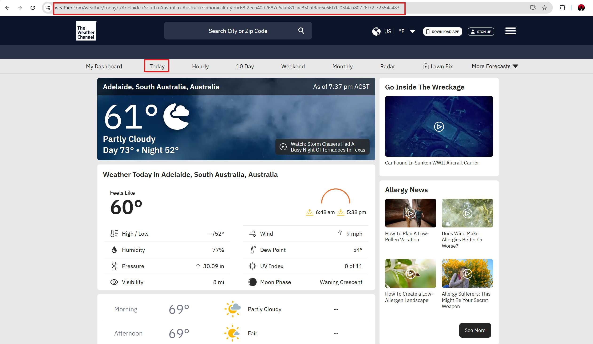
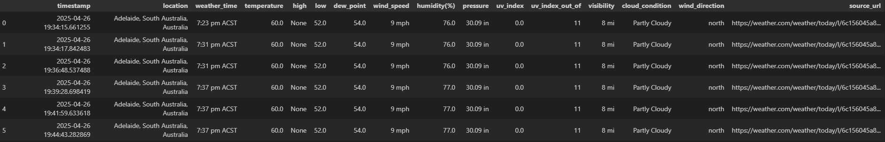

# Weather Scraper

`WeatherScraper` is a Python package to **scrape real-time weather information** from [weather.com](https://weather.com/).  
It collects temperature, humidity, UV index, cloud conditions, and more into structured data you can easily export to **CSV** or use for **analysis** in **Pandas**.

This tool is useful for **weather data collection**, **monitoring changes over time**, or **building datasets** for machine learning and analytics.

---

## 📦 Installation

You can install the required dependencies via `conda` or `pip`:

### Using `conda`:
```bash
conda create -n weatherscraper python=3.10
conda activate weatherscraper
pip install -r requirements.txt
```

### Using `pip`:
```bash
pip install -r requirements.txt
```

---

## 🔥 How to Use

### 1. Get your URL from weather.com
- Go to [weather.com](https://weather.com/)
- Search for your desired location (e.g., "Adelaide, South Australia, Australia")
- Click on **Today** tab
- Copy the URL (it should look like:  
  `https://weather.com/weather/today/l/6c156045a8c34bd5b529f6d9a700c8a8d030deda1a58e90c4195a9e37c51c29e`)


---

## ⚙️ Example Usage
Below code is available in web_scraping.py file
```python
from weather_scraper import WeatherScraper

# Initialize with one or more URLs
urls = [
    "https://weather.com/weather/today/l/Adelaide+South+Australia+Australia?canonicalCityId=68f2eea40d2687e6aab81cac850af9ae6c66f7fc05f4aa80726f72f72554c483"
]
scraper = WeatherScraper(urls)

# Scrape once
scraper.scrape()

# Or scrape continuously
scraper.start_scraping(interval=600, duration=1800)

# Export collected data
scraper.to_csv('weather_log.csv')
```

---

## 📝 Output

### 1. Using scrape() outputs a dictionary
   ```
   [{'timestamp': datetime.datetime(2025, 4, 26, 19, 34, 15, 661255),
  'location': 'Adelaide, South Australia, Australia',
  'weather_time': '7:23 pm ACST',
  'temperature': 60.0,
  'high': None,
  'low': 52.0,
  'dew_point': 54.0,
  'wind_speed': '9 mph',
  'humidity(%)': 76.0,
  'pressure': '30.09 in',
  'uv_index': 0.0,
  'uv_index_out_of': 11,
  'visibility': '8 mi',
  'cloud_condition': 'Partly Cloudy',
  'wind_direction': 'north',
  'source_url': 'https://weather.com/weather/today/l/6c156045a80ea16d0b5de3046cd3b043bc4787a05ac9242c6f80cdc2c8210ec1'}]
   ```

---

### 2. Using start_scraping() or get_data() outputs a pandas dataframe:
   
```
Note: The column high in the above pandas dataframe is None. 
      This is because the website did not have any value in the high temperature when scraping the data, as shown in the screenshot of the website above
```

## 📄 Description of the Code

### `class WeatherScraper`

#### Purpose
Scrapes weather details from one or more weather.com URLs and allows exporting the data.

---

### `__init__(self, url)`

- **url**: a **single string** (for one URL) or a **list of strings** (for multiple URLs).
- Initializes an empty list `self.data` to collect all weather records.

---

### `scrape(self)`

- Scrapes **all provided URLs**.
- Returns a **list of dictionaries**, where each dictionary contains weather details like timestamp, temperature, humidity, etc.
- **Raises an error** if:
  - URL is invalid (not from "today" section of weather.com)
  - Response fails (e.g., site down or bad URL)
  - Unable to find Today's Details module in the page

Each dictionary contains:

| Column | Description |
|:---|:---|
| `timestamp` | Current UTC time when data was collected |
| `location` | Location name from weather.com |
| `weather_time` | The local time reported on weather.com for the weather data |
| `temperature` | Current temperature (in °F by default) |
| `high` | Forecasted high temperature for the day |
| `low` | Forecasted low temperature for the day |
| `dew_point` | Dew point temperature |
| `wind_speed` | Wind speed along with unit (e.g., "14 mph") |
| `humidity(%)` | Humidity percentage |
| `pressure` | Atmospheric pressure along with unit (e.g., "30.03 in") |
| `uv_index` | UV Index value |
| `uv_index_out_of` | UV Index scale maximum (e.g., out of 11) |
| `visibility` | Visibility along with unit (e.g., "8 mi") |
| `cloud_condition` | General description of the sky (e.g., "Partly Cloudy") |
| `wind_direction` | Compass direction of wind (e.g., "north") |
| `source_url` | The original URL the data was scraped from |

---

### `start_scraping(self, interval=300, duration=3600)`

- **interval** (optional): Time between scrapes, in seconds.  
  Default is `300 seconds` (5 minutes).
- **duration** (optional): Total time to keep scraping, in seconds.  
  Default is `3600 seconds` (1 hour).

**Functionality**:
- Continuously scrapes data at every `interval` for `duration`.
- Returns the collected weather data as a **pandas DataFrame**.

Example:
```python
scraper.start_scraping(interval=600, duration=3600)
```
Scrapes data every 10 minutes for 1 hour.

---

### `get_data(self)`

- Returns all the weather data collected so far as a **pandas DataFrame**.

Example:
```python
df = scraper.get_data()
print(df.head())
```

---

### `to_csv(self, filepath='weather_data.csv')`

- Saves the collected data to a CSV file.
- **filepath** (optional): Path to save the CSV. Default is `'weather_data.csv'`.

**Raises** an error if no data has been collected yet.

Example:
```python
scraper.to_csv("my_weather_log.csv")
```

---

## ⚠️ Important Notes

- The scraper **only works with "today's weather" pages** on weather.com (URLs must contain `/weather/today/`).
- Be mindful of how frequently you scrape to avoid overloading the site (use reasonable intervals).
- The script **raises exceptions** if any part of the scraping process fails (invalid URL, server error, structure change).

---

## Author

Hariharan Durairaj
